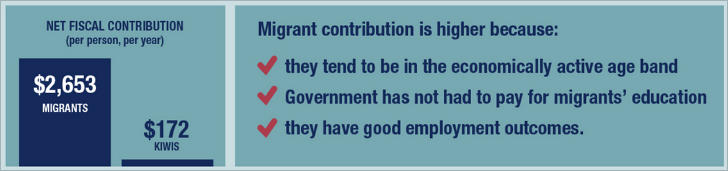

# Are migrants a burden to countries of destination?
id:: 66d4d819-f321-4de3-a5b3-1af240b8dab3
	- ## Argument
		- No, in fact they are an overall benefit
	- ## Facts
		- ## For
			- It is estimated that nearly two-thirds of international migrants are migrant workers, contributing to the economies and societies where they live.
			- [[@Impact of Migration Processes on GDP]]
				- In 2015 alone, it is estimated that migrants contributed over 9 per cent (or USD 6.7 trillion) to global GDP.
			- For example, it is estimated that between 1990 and 2014, migrants added GBP 175 billion and GBP 155 billion to the GDP of the United Kingdom and Germany, respectively.
			- Available data reveal that international remittances reached USD 702 billion in 2020 (up from USD 128 billion in 2000). Remittances to low- and middle-income countries already outstrip both ODA and FDI, significantly contributing to poverty alleviation and development.
			- 
		- ## Against
			- Use public services and resources
			- Put strain on the health system
			- ***However, they contribute more than they use***
-
- # Do migrant steal jobs from locals?
  id:: 66d4d939-a049-4158-8731-e1e5d9c6f1de
	- ## Argument
		- No, they fill gaps in the labor market
		- There is a labor shortage, so we actually need them
	- ## Facts
		- Although migrants are represented across all skill levels, many among them work in the so-called 3D jobs (dirty, dangerous, and demanding) such as in construction, domestic work, or hospitality. These jobs tend to be the least favored by the native-born. Many countries of destination rely on international migrants to address labor market shortages. The
		  COVID-19 pandemic has shed a light on the essential roles that migrant workers have long played in the functioning of society, including in critical sectors such as healthcare and the food industry.
		- Migrants provide a source of economic dynamism globally, and are overrepresented in innovation and patents, arts and sciences awards, start-ups, and successful companies.
- # Shouldn’t we stop migrants to reduce the threat of terrorism?
  id:: 66d4d99e-8563-4337-a0f1-f70f89893dde
	- ## Argument
		- No, most terrorists are from the country they are attacking
	- ## Facts
		- Migrants, asylum seekers and refugees are more likely to be the victims of violent extremism than the perpetrators of those acts. Violent extremism is a driver for internal displacement and migration.
			- [[@World Migration Report 2018]]
		- The majority of recent terrorist attacks were committed by citizens of the country where they occurred. The overwhelming majority of terrorist attacks worldwide occur in developing and least developed countries, particularly those affected by conflict and violence.
			- [[@Most terrorist attacks in the US are committed by Americans — not foreigners | Vox]]
		- [[@The Southern Border Poses Terrorism Risks. Homegrown Threats Still Loom Larger. | Council on Foreign Relations]]
		- [[@Terrorism in America After 9/11]]
			- 134 - far right
			- 107 - jihadist
			- 17 - Ideological Misogyny/Incel Ideology
			- 13 - Black Separatist/Nationalist/Supremacist
			- 1 - Far Left Wing
		- [[@Christchurch mosque shootings]]
			- Shooter was a white supremacist from Australia who lived in New Zealand for 18 months before committing the shootings.